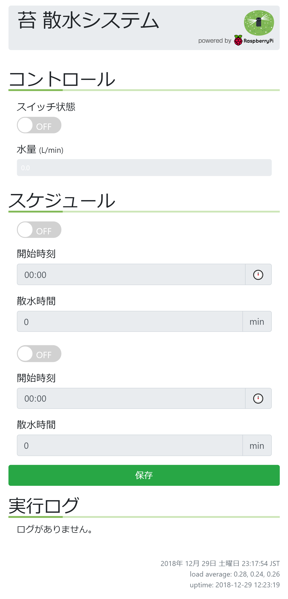

# rasp-water

Raspberry Pi を使って自動的に水やりをするシステムです．

## 機能

-   スマホやパソコンから蛇口の開閉が行えます．
-   水流量がリアルタイムに確認できます．
-   スケジュール機能を使って自動水やりが行えます．
-   水やりの記録が確認できます．

## 構成

Angular で作られた UI と，Flask で作られたアプリケーションサーバで構成
されます．raspi-gpio を使って GPIO を制御し，その先につながった電磁弁
で蛇口の開閉を行います．

ハード関係は[ブログ](https://rabbit-note.com/2018/12/31/raspberry-pi-watering-system-hard/)で紹介しています．

## カスタマイズ

電磁弁の制御は rasp_water.py の {set,get}\_valve_state で行っていますの
で，ここを書き換えることで制御方法を変えることができます．

## スクリーンショット



## 準備

### ADS1015 のドライバの有効化

/boot/config.txt に次の行を追加．

```bash:bash
dtoverlay=ads1015,cha_gain=0
```

## 設定

`src/config.example.yml` を `src/config.yml` に名前変更します．
環境に合わせて適宜書き換えてください．

Slack を使っていない場合は，Slack の設定をコメントアウトしてください．

## 実行

`docker build` でイメージを構築し，`flask/app/app.py` を動かします．

Kubernetes 用の設定ファイルが `kubernetes/outdoor_unit_cooler.yml` に入っていますので，
これを参考にしていただくと良いと思います．

カスタマイズが必要になりそうなのは下記の項目になります．

<dl>
  <dt>namespace</dt>
  <dd> `hems` というネームスペースを作っていますので，環境に合わせて変更します．</dd>

  <dt>PersistentVolume</dt>
  <dd>スケジュールデータを格納する場所を確保します．</dd>

  <dt>external-dns.alpha.kubernetes.io/hostname</dt>
  <dd>ExternalDNS で設定するホスト名を指定します．環境に合わせて変更いただくか，不要であれば削除します．</dd>

  <dt>image</dt>
  <dd>ビルドしたイメージを登録してあるコンテナリポジトリに書き換えます．</dd>

  <dt>nodeSelector</dt>
  <dd>Pod を配置したいノード名に変更します．</dd>
</dl>
